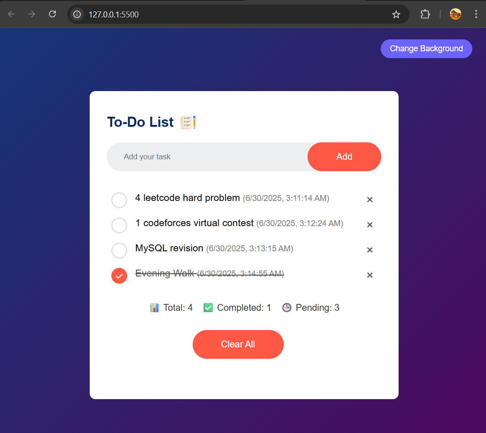

# 📝 To-Do List

A simple and responsive to-do list web app built with HTML, CSS, and JavaScript.  
It allows users to add, check, delete, and save tasks using local storage.

## ✨ Features

- Add and delete tasks
- Mark tasks as completed
- Save tasks in local storage
- View total, completed, and pending task count
- Clear all tasks at once
- Toggle background with a click
- Timestamps for each task

## 📷 Preview

## 🛠️ Technologies

- HTML
- CSS
- JavaScript (Vanilla)

---